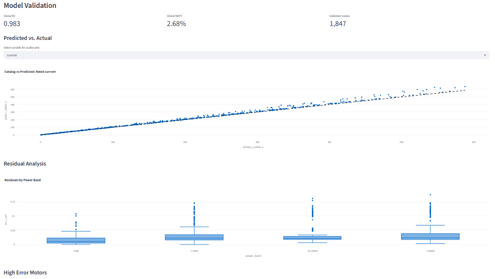

# Guimarães Method Dashboard ⚡

[](https://www.python.org/)
[](https://streamlit.io/)
[](https://plotly.com/)
[](https://creativecommons.org/licenses/by-nc-nd/4.0/)
[](Memoria-Francisco-de-As%C3%ADs-L%C3%B3pez-Moreno-22.07.pdf)

An interactive web dashboard built with **Streamlit** for the analysis, estimation, and validation of equivalent circuit parameters in induction motors using the **Guimarães method**.

Developed as part of the **Final Year Project (TFG)** by *Francisco de Asís López Moreno*.

> 📖 **Read the Complete Thesis / Memoria:** [Memoria-Francisco-de-Asís-López-Moreno-22.07.pdf](Memoria-Francisco-de-As%C3%ADs-L%C3%B3pez-Moreno-22.07.pdf)

---

## 📸 Preview



---

## 📖 Project Documentation & Thesis

The full documentation and academic memory for this project are included in the repository:

- 📄 **[TFG Thesis Document (PDF)](Memoria-Francisco-de-As%C3%ADs-L%C3%B3pez-Moreno-22.07.pdf)**: Detailed dissertation covering mathematical derivations, parameter extraction algorithm, experimental validation, and comparative analysis across IEC efficiency classes.

---

## ✨ Features & Modules

The dashboard is structured into four main analytical views:

- **📊 Summary View**: Overview of overall results, dataset metrics, number of solved and validated motors, and global runtime evaluation reports.
- **✅ Validation View**: Detailed evaluation of model accuracy and error metrics across different motor series (e.g., WEG W21 and W22) and efficiency standards (IE1 through IE5).
- **📈 Typical Models View**: Regressions, typical parameter distributions ($R_1, R_2, X_1, X_2, X_m$), and parameter trends across power ranges and pole counts.
- **⚙️ Motor Case Explorer**: In-depth analysis of individual motor cases, operating curves, torque-speed profiles, and equivalent circuit behavior.

---

## 🛠️ Tech Stack

- **Frontend & App Framework**: [Streamlit](https://streamlit.io/)
- **Data Manipulation & Analysis**: [Pandas](https://pandas.pydata.org/), [NumPy](https://numpy.org/)
- **Visualization**: [Plotly](https://plotly.com/), [Matplotlib](https://matplotlib.org/)

---

## 📂 Project Structure

```text
.
├── dashboard/
│   ├── app.py               # Streamlit application entry point
│   ├── data_loader.py       # Data parsing, caching, and preprocessing
│   └── views/               # UI views and component pages
│       ├── summary.py
│       ├── validation.py
│       ├── typical_models.py
│       └── motor_case.py
├── outputs/                 # Model parameters, validation metrics, and plots (CSV/JSON/PNG)
├── Memoria-Francisco-de-Asís-López-Moreno-22.07.pdf  # Final Year Project (TFG) Report
├── requirements.txt         # Project dependencies
├── image.png                # Dashboard interface preview screenshot
└── README.md                # Project documentation
```

---

## 🚀 Getting Started

Follow these steps to set up and run the dashboard locally.

### 1. Prerequisites

Ensure you have **Python 3.10+** installed:
```bash
python --version
```

### 2. Clone the Repository

```bash
git clone git@github.com:fralopmor-arch/tfg-presentacion-guimaraes.git
cd tfg-presentacion-guimaraes
```

### 3. Create and Activate a Virtual Environment

- **Windows (PowerShell):**
  ```powershell
  python -m venv .venv
  .venv\Scripts\Activate.ps1
  ```

- **Linux / macOS:**
  ```bash
  python3 -m venv .venv
  source .venv/bin/activate
  ```

### 4. Install Dependencies

```bash
pip install --upgrade pip
pip install -r requirements.txt
```

### 5. Launch the Dashboard

```bash
streamlit run dashboard/app.py
```

Once running, open your browser and navigate to `http://localhost:8501`.

---

## 📄 License

This repository contains the Final Year Project (TFG) by **Francisco de Asís López Moreno**.

This work is licensed under a [Creative Commons Attribution-NonCommercial-NoDerivatives 4.0 International License (CC BY-NC-ND 4.0)](https://creativecommons.org/licenses/by-nc-nd/4.0/).

```text
SPDX-License-Identifier: CC-BY-NC-ND-4.0
```